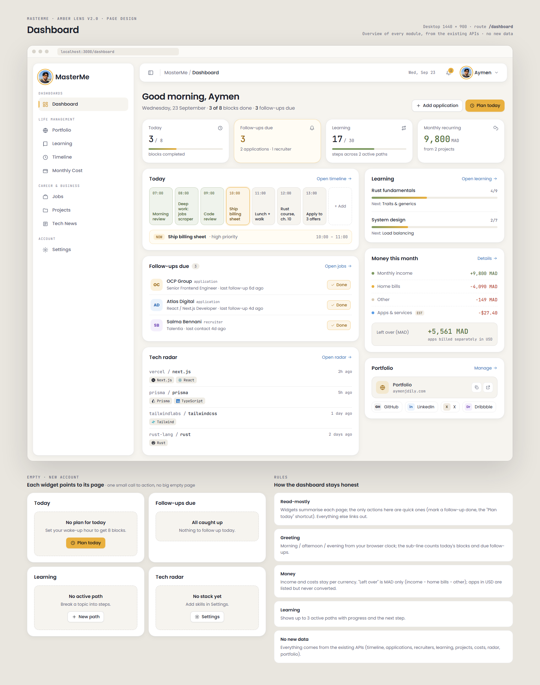
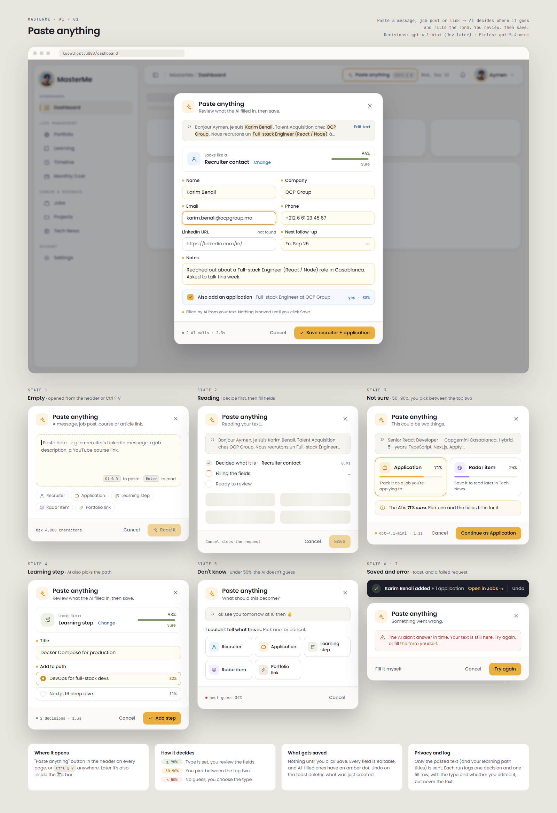
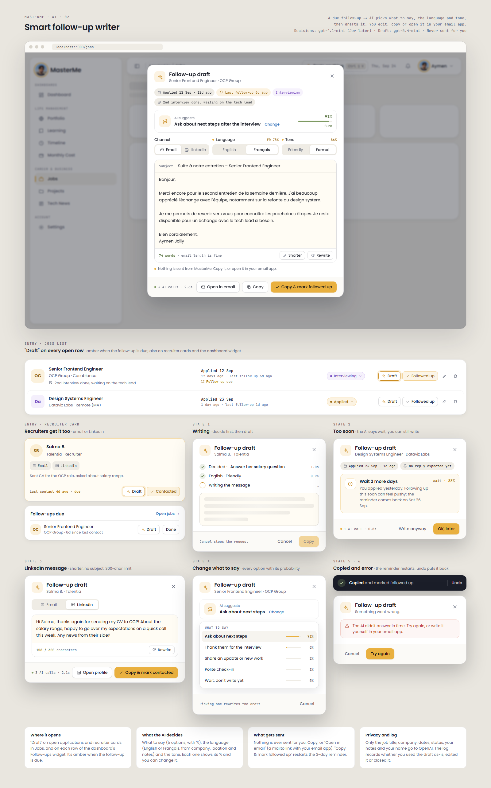
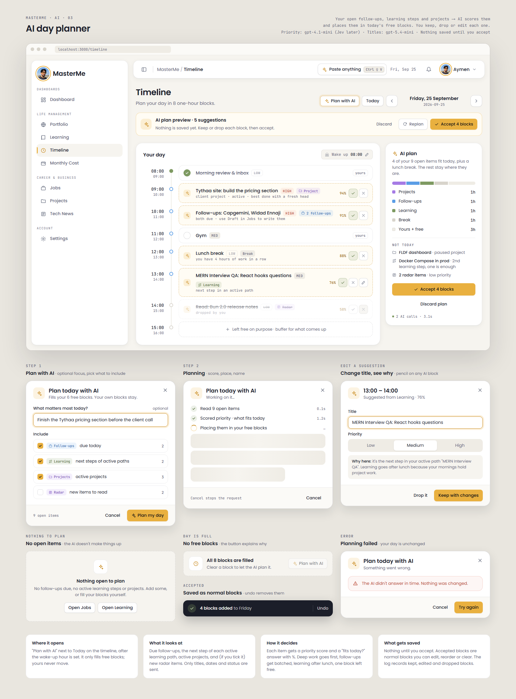
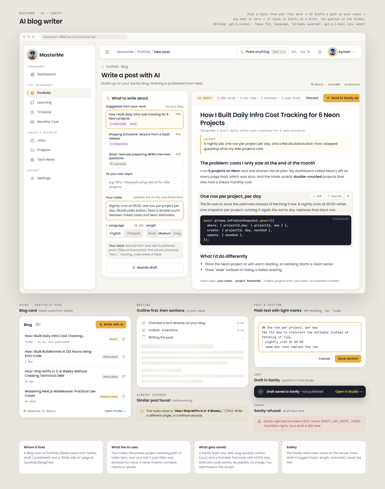
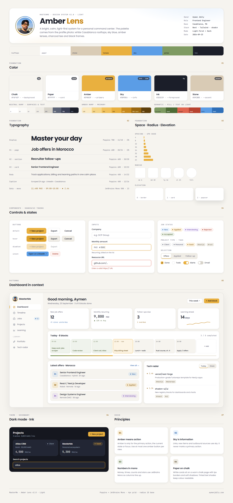

<div align="center">


# MasterMe

**One place to run my professional life: portfolio, learning, daily plan, job hunt, projects, money and tech radar, with AI that actually helps.**

[](https://nextjs.org)
[](https://www.typescriptlang.org)
[](https://tailwindcss.com)
[](https://www.prisma.io)
[](https://neon.tech)
[](https://platform.openai.com)
[](https://www.sanity.io)

</div>

<br />

<p align="center">
  
</p>

---

## ✨ What it does

| Module | What you get |
| --- | --- |
| 🏠 **Dashboard** | Greeting, today's 8 blocks, follow-ups due, learning progress, money this month, tech radar and portfolio at a glance. |
| 🌐 **Portfolio & Links** | Portfolio links and social profiles in one hub, plus your **Sanity blog** with an AI writer. |
| 📚 **Learning** | Learning paths with ordered steps, progress and status (active, paused, completed). |
| ⏱️ **Timeline** | Your day in **8 one-hour blocks** from your wake-up time, with status, priority, reorder and a NOW marker. |
| 💰 **Monthly Cost** | Home, apps and other bills per currency, plus Neon and Vercel costs computed from your projects. |
| 💼 **Jobs** | Applications and recruiters with a **3-day follow-up rhythm**, due reminders, and "end conversation" with a reason. |
| 🗂️ **Projects** | Client, personal and SaaS projects with one-time and monthly income, live previews and **daily infra cost** (Neon + Vercel). |
| 📡 **Tech Radar** | Recently updated GitHub repos for the languages and frameworks in your stack, fetched every day. |
| ⚙️ **Settings** | Profile, your stack (drives the radar and AI) and security. |

## 🤖 AI that stays honest

Every AI feature follows the same rules: **decisions come with a confidence %**, results are **drafts you review**, nothing is sent or published for you, and the AI **only uses facts from your data**.

| Feature | How it helps |
| --- | --- |
| **Paste anything** (`Ctrl ⇧ V`) | Paste a recruiter message, job post or course link. The AI decides what it is and fills the right form. |
| **Smart follow-up writer** | Picks what to say, the language (EN/FR) and the tone, then drafts the follow-up. Copy it, or open it in your email app. |
| **AI day planner** | Scores your open follow-ups, learning steps and projects, and fills today's free blocks. Your own blocks never move. |
| **AI blog writer** | Topic ideas from your real work, written in your voice, sent to **Sanity as an unpublished draft**. |
| **Confidence gating** | ≥ 90% act · 50–90% ask you · < 50% don't guess. Risky actions always ask. |
| **AI log** | Every call is logged (latency, tokens, cost, confidence, and whether you accepted or edited it), never your text. |

Decisions use a **Jev-shaped interface** (typed `choice` / `score` / `noul` answers with probabilities). They run on OpenAI today and switch to [Jev](https://typesafe.ai) with one env flag.

<table>
  <tr>
    <td></td>
    <td></td>
  </tr>
  <tr>
    <td></td>
    <td></td>
  </tr>
</table>

## 🧱 Tech stack

- **Framework:** Next.js 16 (App Router, Turbopack), React 19, TypeScript
- **UI:** Tailwind CSS 4, shadcn/ui on Base UI, lucide and simple-icons, custom *Amber Lens* design system
- **Data:** PostgreSQL (Neon) + Prisma 7, Zod validation, React Query, React Hook Form
- **Auth:** Better Auth (email and password)
- **AI:** OpenAI (`gpt-5.4-mini` for writing, `gpt-4.1-mini` for decisions with logprobs), Jev-ready
- **Integrations:** Sanity (blog drafts), Neon API (infra cost), GitHub API (tech radar)
- **Jobs:** Vercel Cron for the daily infra cost, job scraping and radar fetch

## 🏗️ How it's built

```text
Browser ── only UI and calls to /api routes (no tokens, no third-party calls)
   │
Next.js route handlers ── session check (Better Auth) · Zod validation · user-scoped Prisma queries
   │
   ├── PostgreSQL (Prisma)      all user data, AI log, daily infra snapshots
   ├── OpenAI                   drafts and decisions (server-only key)
   ├── Sanity                   blog drafts (server-only write token)
   ├── Neon API / GitHub API    infra cost, tech radar
   └── Vercel Cron              05:00 infra cost · 06:00 jobs · 07:00 radar
```

Heavy work (scraping, radar fetch, cost calculation) runs **offline on a schedule**, and pages read the stored results. Every table is scoped to the signed-in user.

## 🚀 Getting started

**Requirements:** Node.js 20+, a PostgreSQL database (e.g. [Neon](https://neon.tech)).

```bash
git clone https://github.com/Aymenjdily/masterme.git
cd masterme
npm install
cp .env.example .env.local      # then fill in the values below
npm run db:push                 # create the tables
npm run dev                     # http://localhost:3000
```

Optionally, `npm run seed` creates a demo account while the dev server is running. Change its password before using it for real.

### Environment variables

| Variable | Required | Used for |
| --- | :---: | --- |
| `DATABASE_URL` | ✅ | PostgreSQL connection |
| `BETTER_AUTH_SECRET`, `BETTER_AUTH_URL`, `NEXT_PUBLIC_BETTER_AUTH_URL` | ✅ | Authentication |
| `CRON_SECRET` | ✅ | Protects the scheduled routes |
| `OPENAI_API_KEY`, `OPENAI_MODEL`, `OPENAI_DECISION_MODEL`, `DECISION_PROVIDER` | for AI | AI features |
| `NEON_API_KEY` | optional | Infra cost per project |
| `GITHUB_TOKEN` | optional | Higher GitHub rate limits for the radar |
| `NEXT_PUBLIC_SANITY_PROJECT_ID`, `NEXT_PUBLIC_SANITY_DATASET`, `NEXT_PUBLIC_SANITY_API_VERSION`, `SANITY_API_WRITE_TOKEN`, `SANITY_STUDIO_URL` | optional | AI blog writer |

All secrets stay on the server. See [`.env.example`](.env.example).

### Scripts

| Command | What it does |
| --- | --- |
| `npm run dev` / `build` / `start` | Develop, build, run |
| `npm run lint` / `typecheck` | Checks |
| `npm run db:push` / `db:studio` | Sync the schema, browse data |
| `npm run news:fetch` | Fetch the tech radar now |
| `npm run infra:recalc` | Recalculate today's infra cost |
| `npm run scrape:jobs` | Run the job scraper |
| `npm run ai:smoke` / `ai:try -- "text"` | Check the AI setup / try it on any text |
| `npm run check:pt` | Check the markdown → Portable Text converter |

## 🎨 Design

Every page was designed first as a board in [`design/`](design) (light **Amber Lens** theme: sky, amber, charcoal, Casablanca white, olive), then built to match.

<p align="center">
  
</p>

## 📁 Project structure

```text
src/
├── app/
│   ├── (dashboard)/        dashboard, portfolio, learning, timeline, monthly-cost, jobs, projects, news, settings
│   └── api/                route handlers (session-checked, Zod-validated)
├── components/             ui/ primitives, ai/ features, one folder per module
└── lib/
    ├── ai/                 decisions (Jev-shaped), OpenAI wrapper, confidence, log, features
    ├── sanity.ts           blog drafts
    ├── infra-cost.ts       daily Neon cost snapshots
    └── portable-text.ts    markdown ↔ Portable Text
prisma/schema.prisma        data model
design/                     design boards (HTML + PNG)
prompts/                    implementation prompt for every feature
scripts/                    seed, scrapers, cron twins, AI checks
```

## 👤 Author

**Aymen Jdily**, Full-Stack Engineer · [aymenjdily.com](https://www.aymenjdily.com) · [GitHub](https://github.com/Aymenjdily)
